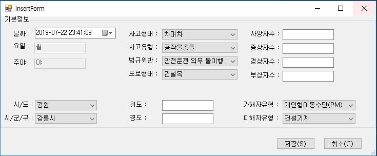
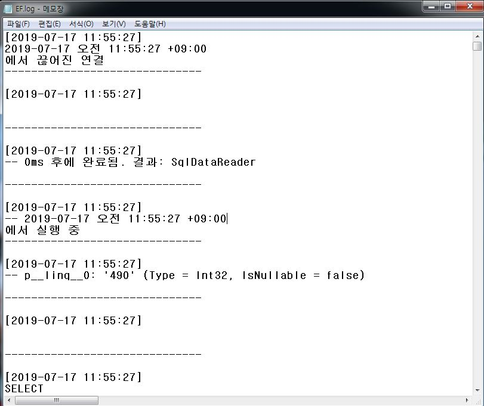

# AccidentProj

# **사망자발생 교통사고 조회 및 추가 프로그램**
*공공데이터포털 2012~2018사망자발생교통사고 데이터 이용

하승민

## **1. 개요**

 본 프로그램을 통해 사망자 발생 교통사고를 조회할 수 있고, 이후 사고 발생시 사고를 추가 할 수 있다. 관리자모드/일반모드로 나뉘어 일반모드는
 사고 조회만 가능하고, 관리자 모드는 사고 추가, 관리자 추가 및 삭제가 가능하다
 

 ## **2.클래스 다이어그램**
 
 
 
 ## **3.프로그램 구조**
 

   본 프로그램은 하나의 솔루션에 두 개의 프로젝트로 구성되어있다. WinForm과 control들을 디자인하는 Accident프로젝트와 DB와 Data, Entity Framework가
  있는 Accident.Data프로젝트이다. 두 프로젝트는 참조 되어있다.
   
   로그를 통해 DB접속 및 변경사항 발생 시 파일로 저장된다.
   
 ## **4.기능 및 메시지 일람**
 
  

 프로그램 실행시 가장 기본이 되는 MainForm 화면이다. 

 기본 실행시, 일반 모드로 실행되며 상태바에 일반모드로 나타난다. 

 통계조회 / 자료검색 / 광고 / 관리자 모드의 4가지 버튼이 존재하고,

 통계조회(TAAS 교통사고 분석 시스템) / 광고(도로교통공단 최신뉴스)는 해당 사이트로 이동을 하고, 

 자료검색은 MS-SQL에 올려진 2012 ~ 2018의 사망교통사고 데이터를 조회한다.
   

 교통사고를 조회하는 기본 화면이다. 날짜 범위와 지역을 선택하고, 검색을 누르면 해당 조건에 맞는 사고가 검색된다.

 UserControl을 이용하여 각 항목들을 구성하고, UserControl과 UserControl, Form 사이 이벤트를 생성하여 동작하도록 설계하였다.
 
    

 출력 옵션을 선택할 수 있는 화면이다. 출력옵션 체크박스를 선택하면, Visible Fasle 돼있던 출력옵션 UserControl Visible 속성을
 True로 바꾸고 옵션을 선택할 수 있게 된다. 마찬가지로 이벤트를 생성하여 처리하도록 설계하였다.

 선택한 출력 옵션만 DataGridView에 나타나는 것을 볼 수 있다.
 

 출력된 DataGridView에서 조회할 사건의 Row를 더블클릭하면 LocationForm이 생성되고, 해당 사고의 위치를 나타낸다.
 WebBrowser를 이용하고, 위도와 경도를 추가하여 위치를 나타내었다.

 
 
관리자 모드로 접속하기 위한 화면이다. ID와 Password를 입력하면 관리자 모드로 진입한다.
   
  
 
올바른 ID와 PW가 입력되면 환영메시지를 띄우고, 관리자 모드로 진입하게 된다.

 
올바르지 않은 ID와 PW가 입력되면 해당 메시지를 띄우고 관리자 모드로 진입이 실패한다.
  

 
 관리자 모드 진입 화면이다. 일반모드에는 없던 자료추가, 로그아웃 버튼이 새로 생기고, 광고 대신 ID생성이 자리잡았다.

 자료추가는 교통사고 정보를 추가하는 InsertForm을 생성하게 되고,
 
 ID 생성은 관리자 ID를 추가하고 삭제하는 UserloginForm이 생성된다.

 로그아웃은 관리자 모드를 포기하고, 일반모드로 재진입 한다.

 UserloginForm이 생성되고, 해당 화면에서 Insert키를 누르면 AddAdiminInfo Form이 생성된다.

 AddAdminInfo Form에서 관리자 ID가 새로 생성되는 화면이다.
  

 UserloginForm이 생성되고, 해당 화면에서 삭제할 데이터의 Row를 클릭하고 Delete키를 누르면 해당 정보가 삭제된다.

 관리자 모드에서 자료추가 버튼을 클릭하여 InsertForm이 실행된 화면이다.

 요일과 주야는 DateTimePicker에서 선택된 날짜/시간에 맞게 자동으로 조정되므로 입력할 필요가 없고,

 나머지 정보들은 직접 입력해 주어야 한다.

 시/도를 선택 시, 그에 해당하는 시/군/구가 필터링 되어 나타나게 된다.

 입력하지 않은 항목이 존재한 채로 저장을 클릭하면 해당 메시지가 출력되고 저장이 되지 않는다.

 해당 기능은 데이터베이스 데이터무결성을 위해 꼭 필요한 에러 메시지 이다.

 프로젝트의 주제 상, 사고 데이터가 입력되면 삭제 / 수정이 불가능하게 만들어졌다.

 따라서 사고 추가시 최종적으로 확인하는 메시지를 출력하는 화면이다.

 혹시모를 Enter에 의한 등록을 막기위해 Focus를 아니요에 맞춰두었다.

 

 최종 확인이 끝나고 업로드가 완료되면, 해당 메시지를 출력한다.

 

 자료검색에서 해당 데이터가 추가된 것을 확인 할 수 있다.

 

 마찬가지로 DB에서도 해당 데이터가 정상적으로 업로드 되었음을 알 수 있다.
      

  
 보안 이슈에 대응하기 위해 DB에 접속하거나, DB에 INSERT / UPDATE / DELETE 발생 시 LOG파일을 남겨두었다.

  MainForm의 스트립 메뉴이다. 

 문제를 보고하거나, 문의를 하는 FunctionProposeForm이 생성된다.

 문의를 받고 문제를 보고 받은 데이터를 정상적으로 확인하였다.
